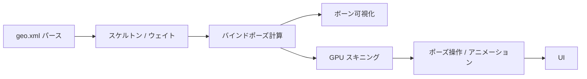

リギング機能の追加は、すでに **geo.xml 側にデータ構造の下地がある**一方で、**アプリ側はまだ一切読んでいない**状態です。現状を整理したうえで、段階的な実装方針を提案します。

## 現状

### geo.xml にはリギング用タグが既にある

`data/cube.geo.xml` の Triangle バッチには、次のような要素が含まれています。

```10:23:data/cube.geo.xml
		<vertex_group>
		<group name="Bone"><indices /></group>
		</vertex_group>
		<skelton count="1" name="TestCubeSkelton">
			<node name="Bone">
				<pos>0.0 0.0 0.0</pos>
				<tail_pos>0.0 0.0 1.0</tail_pos>
				<weights />
				<target_indices />
				<x_axis>1.0 0.0 0.0</x_axis>
				<y_axis>0.0 1.0 0.0</y_axis>
				<z_axis>0.0 -1.0 0.0</z_axis>
			</node>
		</skelton>
```

想定される意味はおおよそ次のとおりです。

| 要素 | 想定される役割 |
|------|----------------|
| `vertex_group` / `group` | ボーン名ごとの頂点インデックス |
| `skelton` / `node` | ボーン階層（`count`, `name`） |
| `pos` / `tail_pos` | ボーンの根元・先端位置 |
| `x_axis` / `y_axis` / `z_axis` | バインドポーズのローカル座標系 |
| `weights` / `target_indices` | スキニング用の頂点ウェイト |

※ XML タグ名は `skelton`（skeleton の綴り違い）です。既存データとの互換のため、パーサ側ではこの綴りをそのまま受け入れるのが安全です。

### アプリ側は静的メッシュのみ

- `geo_parser.d` は `vertex`, `normal`, `indices` など幾何データだけをパース
- `geo_model.d` の `TriangleBatch` / `LineBatch` にボーン情報のフィールドなし
- `mesh.d` は position + normal のみ GPU アップロード
- `shader.d` は通常の `uModel` / `uMVP` 変換のみ（スキニングなし）

つまり、**フォーマットはリギング対応を見据えているが、ビューアは静的表示専用**という段階です。

---

## リギングで実装すべきこと（全体像）



大きく分けると次の 4 層です。

1. **データ層** — ボーン・ウェイト・頂点グループのパースと保持
2. **ランタイム層** — ボーン変換行列、階層更新、逆バインド行列
3. **描画層** — ボーン表示、スキニングシェーダ
4. **UI 層** — ボーン選択、回転操作、ウェイト表示

---

## 推奨する段階的実装

### Phase 1: パース + ボーン可視化（最初のマイルストーン）

**目的**: リギングデータが正しく読めているかを目で確認できるようにする。

**追加するデータ構造（`geo_model.d` 想定）**

```d
struct BoneNode {
    string name;
    vec3 pos;
    vec3 tailPos;
    vec3 xAxis, yAxis, zAxis;
    float[] weights;
    uint[] targetIndices;
    int parentIndex = -1;  // 階層があれば後で
}

struct Skeleton {
    string name;
    BoneNode[] bones;
}

struct VertexGroup {
    string name;
    uint[] indices;
}

// TriangleBatch に追加
Skeleton skeleton;
VertexGroup[] vertexGroups;
```

**パーサ拡張（`geo_parser.d`）**

- `tryParseTriangle` / `tryParseLine` 内で `vertex_group`, `skelton` を読む
- `pos`, `tail_pos`, `x_axis` などはスペース区切り（`parseFloatArray` で対応可能）
- `weights`, `target_indices`, `group/indices` も同様

**描画**

- 既存の `lineShader` を流用して、各ボーンを `pos` → `tail_pos` の線分として描画
- `axis_gizmo.d` と同様のライン描画パターンで実装しやすい

**UI**

- パネルに `Bones: N` を表示
- 「Show skeleton」チェックボックス

この段階ではメッシュ変形は不要で、**デバッグ価値が高く、リスクが低い**です。

---

### Phase 2: スキニング（メッシュ変形）

**目的**: ボーンを動かすとメッシュが追従する。

**バインドポーズ行列**

各ボーンについて、geo.xml の軸情報からローカル→ワールド変換を組み立てます。

```
bindMatrix = T(pos) * R(x_axis, y_axis, z_axis)
inverseBindMatrix = inverse(bindMatrix)
```

**頂点ウェイトの正規化**

- `weights` + `target_indices` を頂点ごとに集約
- 通常は最大 4 ボーン（GPU の `ivec4` + `vec4` に収める）

**GPU スキニングシェーダ**

`shader.d` の頂点シェーダを拡張します。

```glsl
// 追加 attribute
layout(location = 2) in ivec4 aBoneIds;
layout(location = 3) in vec4 aWeights;

uniform mat4 uBoneMatrices[MAX_BONES];

void main() {
    mat4 skinMatrix = 
        aWeights.x * uBoneMatrices[aBoneIds.x] +
        aWeights.y * uBoneMatrices[aBoneIds.y] +
        // ...
    vec4 skinnedPos = skinMatrix * vec4(aPos, 1.0);
    // ...
}
```

**CPU 側**

- `BoneNode` ごとに現在の変換行列を保持
- 描画前に `finalMatrix[i] = currentMatrix[i] * inverseBindMatrix[i]` を uniform に送る

**メッシュ更新方針**

| 方式 | メリット | デメリット |
|------|----------|------------|
| GPU スキニング（推奨） | 毎フレーム高速 | シェーダ・VBO 拡張が必要 |
| CPU スキニング | 実装が単純 | 頂点数が多いと重い |

---

### Phase 3: ポーズ操作・アニメーション

**最小限の操作**

- ボーン選択（クリック or UI リスト）
- 選択ボーンのローカル回転（例: マウスドラッグで Y 軸回転）
- `R` でポーズリセット

**ランタイム構造（新規モジュール案）**

```
source/skeleton.d   — 階層更新、行列計算
source/skinning.d   — ウェイト集約、GPU uniform 準備
```

**階層**

現サンプルはボーン 1 本のみですが、複数ボーン対応では:

- `node` に `parent` 属性を追加するか、XML のネストで親子を表現
- 子ボーンのワールド行列 = 親のワールド × 子のローカル

**アニメーション（将来）**

- キーフレーム（時間, ボーン名, 回転/位置）を geo.xml か別ファイルで定義
- 再生・スクラブ用 UI

---

### Phase 4: UI・デバッグ機能

- ウェイトの色分け表示（赤=1.0, 青=0.0）
- 頂点グループのハイライト
- ボーン名ラベル（`axis_label.d` の仕組みを流用可能）
- エクスポート元（Blender 等）との整合確認用ログ

---

## ファイルごとの変更イメージ

| ファイル | 変更内容 |
|----------|----------|
| `geo_model.d` | `BoneNode`, `Skeleton`, `VertexGroup` 追加 |
| `geo_parser.d` | `skelton`, `vertex_group` パース |
| `skeleton.d`（新規） | 行列計算、ポーズ管理 |
| `mesh.d` | boneIds/weights を VBO に追加 |
| `shader.d` | スキニング用シェーダ |
| `app.d` | スケルトン描画、操作 UI、描画ループ更新 |

---

## 最初に決めておくとよいこと

実装前に、次の 3 点を決めると迷いが減ります。

1. **スコープ**
   - ボーン表示だけか
   - スキニング変形までか
   - インタラクティブなポーズ操作までか

2. **ウェイトの所在**
   - `node/weights` + `target_indices` を正とするか
   - `vertex_group` を正とするか
   - 両方ある場合の優先順位

3. **ボーン階層**
   - 現フォーマットで親子はどう表現する想定か（フラット + 親名、ネスト、`parent` 属性など）

---

## おすすめの進め方

```
Step 1: geo_parser で skelton を読む → parser-test で検証
Step 2: ボーンをラインで描画（変形なし）
Step 3: weights を頂点にマッピングしてログ出力
Step 4: GPU スキニングで 1 ボーン回転を確認
Step 5: UI でボーン選択・回転
```

`cube.geo.xml` はボーン 1 本・ウェイト空なので、**Phase 1 の検証用**としては十分ですが、**Phase 2 以降はウェイト入りの別サンプル**が必要になります。

---

どこまでを最初のゴールにするか教えてもらえれば、もう一段具体的に（例: `geo_parser.d` に追加する関数のシグネチャ、シェーダの uniform 設計、テスト用 XML の例）まで落とし込めます。実装まで進める場合は Agent モードに切り替えてください。